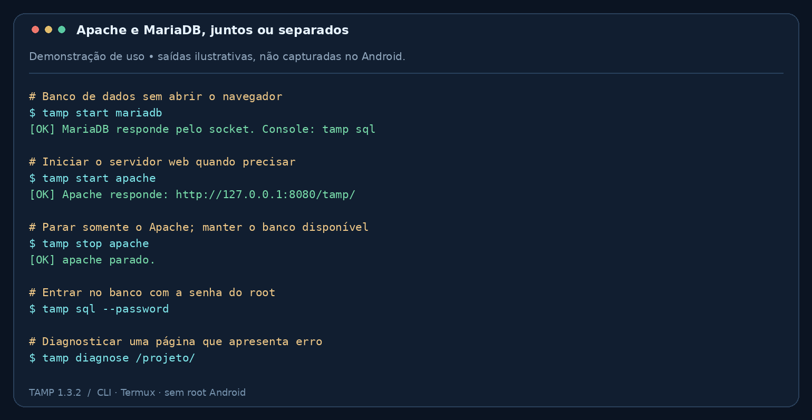
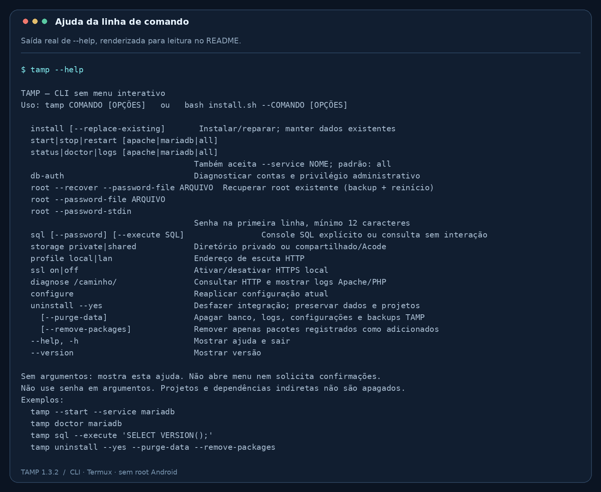

<p align="center">
  
</p>

<h1 align="center">TAMP</h1>
<p align="center"><strong>Seu ambiente PHP no Android, pelo terminal.</strong></p>
<p align="center">Termux · Apache · MariaDB · PHP · phpMyAdmin<br>Sem root Android · CLI sem menu · Versão 1.3.2</p>

O **TAMP** instala e gerencia um ambiente de desenvolvimento web no Termux.
Execute Apache e MariaDB juntos ou separadamente, abra seus projetos PHP no
navegador e administre o banco pelo terminal ou pelo phpMyAdmin.

**Autor:** Oliver Silva · **Projeto:** Install Web Server

> Desenvolvido para uso local. Por padrão, o HTTP fica em `127.0.0.1:8080` e o
> MariaDB em `127.0.0.1:3306`. O perfil LAN libera os projetos na rede, mas mantém
> o painel TAMP e o phpMyAdmin restritos ao aparelho.

## Navegação

[Instalação](#instalação) · [Demonstrações](#demonstrações) ·
[Projetos PHP](#projetos-php) · [MariaDB e phpMyAdmin](#mariadb-e-phpmyadmin) ·
[Comandos](#referência-de-comandos) · [Desinstalação](#desinstalação) ·
[Problemas comuns](#problemas-comuns)

## O que você pode fazer

- Iniciar, parar e reiniciar **Apache**, **MariaDB** ou **ambos**.
- Listar projetos no painel, com links e indicação de arquivo de entrada.
- Usar a pasta privada do Termux ou o armazenamento compartilhado com editores como Acode.
- Configurar a senha da conta `root` existente e acessar o phpMyAdmin.
- Recuperar `root` com backup offline, sem recriar o banco.
- Consultar status, logs e erros HTTP pela CLI.
- Ativar acesso pela rede local e HTTPS com certificado autoassinado.
- Desfazer a integração, com opções separadas para dados e pacotes.

## Instalação

### Requisitos

- Termux funcionando, com acesso aos seus repositórios de pacotes.
- Internet durante a instalação e espaço para os pacotes e bancos.
- Permissão de armazenamento Android **somente se usar a pasta compartilhada**.

O instalador obtém Apache, PHP, integração PHP/Apache, MariaDB, phpMyAdmin,
OpenSSL, curl, runit, termux-services e util-linux. Não exige `sudo`, `su` ou
`root-repo`, e não faz upgrade geral dos pacotes.

### Começar

Baixe ou clone este projeto. Dentro da pasta `Install-Web-Server`, execute:

```bash
bash install.sh --install
tamp start all
```

Para atualizar, execute **o `install.sh` do código novo**. Rodar o comando `tamp`
antigo não baixa atualizações do repositório.

Se houver comandos de uma versão legada que não sejam reconhecidos pelo TAMP:

```bash
bash install.sh --install --replace-existing
```

Essa opção faz backup dos comandos legados antes de substituí-los.
Projetos e o banco dedicado existente são preservados pela atualização.

### Abrir no navegador

| Destino | Endereço |
| --- | --- |
| Painel de projetos | <http://127.0.0.1:8080/tamp/> |
| phpMyAdmin | <http://127.0.0.1:8080/phpmyadmin/> |
| Raiz dos projetos | <http://127.0.0.1:8080/> |
| Exemplo: pasta `projeto` | <http://127.0.0.1:8080/projeto/> |

O painel web exige Apache. O phpMyAdmin exige Apache e MariaDB.

## Demonstrações

### Controle independente dos serviços



*Demonstração gráfica de comandos e saídas ilustrativas. Não é uma captura do Android.*

<details>
<summary><strong>Ver a ajuda completa da CLI</strong></summary>



*A imagem foi renderizada a partir da saída real de `bash install.sh --help`.
Ela não representa uma sessão de execução dos serviços no Android.*

</details>

## Projetos PHP

A pasta padrão é **`~/htdocs`**, no armazenamento privado do Termux.
Para criar um projeto de teste, use uma pasta nova e crie `index.php` nela:

```bash
mkdir -p ~/htdocs/meu-projeto
```

Conteúdo de `~/htdocs/meu-projeto/index.php`:

```php
<?php
echo 'Olá! Meu projeto PHP está funcionando.';
```

Abra <http://127.0.0.1:8080/meu-projeto/> ou atualize o painel `/tamp/`.

### Usar `/sdcard/htdocs` e Acode

```bash
termux-setup-storage
# Conceda a permissão solicitada pelo Android.
tamp storage shared
tamp restart apache
```

O TAMP passa a usar **`~/storage/shared/htdocs`**, que normalmente aponta para a
mesma área de `/sdcard/htdocs`. Para voltar à pasta privada:

```bash
tamp storage private
tamp restart apache
```

**Trocar a configuração não move arquivos.** Coloque os projetos na pasta
escolhida. Guarde arquivos de senha fora de `htdocs` e do armazenamento compartilhado.

### Como funciona a listagem

O painel lê a pasta ativa configurada no Apache e lista suas subpastas imediatas,
em ordem natural. A lista se atualiza ao recarregar a página.

- Pastas com `index.php` ou `index.html` recebem essa indicação.
- Pastas sem índice continuam visíveis, com aviso de configuração adicional.
- Arquivos individuais, pastas ocultas, links simbólicos e os nomes reservados
  `tamp` e `phpmyadmin` não aparecem na lista.
- O painel não executa o código de cada projeto para identificá-lo.

A listagem não configura frameworks automaticamente. Aplicações que exigem
`public/` como raiz precisam de configuração própria. O Apache mantém a
listagem automática de diretórios desativada.

## MariaDB e phpMyAdmin

O banco do TAMP fica em **`$PREFIX/var/lib/tamp/mysql`**. Uma base de instalação
legada não é importada automaticamente. O servidor aceita TCP apenas em
`127.0.0.1:3306` e também mantém seu socket privado.

**`root` aqui é a conta administrativa do MariaDB, não root do Android.**
O TAMP não oferece mais criação de usuários de projeto; contas existentes são
preservadas. Por ser administrativa, a conta root tem acesso amplo aos bancos.

### Definir a senha

Com seu editor, crie `~/senha-root.txt`, em uma pasta privada do Termux.
Coloque uma senha nova de **pelo menos 12 caracteres na primeira linha**.

```bash
chmod 600 ~/senha-root.txt
tamp start mariadb
tamp root --password-file ~/senha-root.txt
```

Outra forma de fornecer a senha, sem colocá-la nos argumentos:

```bash
tamp root --password-stdin < ~/senha-root.txt
```

A operação normal só funciona se já houver uma conta administrativa válida via
socket. O comando verifica a identidade autenticada e o privilégio global direto
`CREATE USER`; conseguir executar `SELECT 1` não é suficiente.

Após o sucesso, entre no phpMyAdmin com **root e a senha configurada**.
O phpMyAdmin usa autenticação por cookie e não armazena essa senha no seu arquivo
PHP de configuração. Login sem senha permanece bloqueado.

### Quando root não entra: recuperação

Primeiro, veja a autenticação disponível sem senha:

```bash
tamp db-auth
```

`Autenticado: @localhost` significa conexão como **usuário anônimo**, não como a
conta solicitada. Se não houver acesso administrativo utilizável, execute:

```bash
tamp root --recover --password-file ~/senha-root.txt
```

A recuperação:

1. Para o MariaDB e exige confirmação da parada.
2. Faz uma cópia offline completa do banco em `backups/before-root-recovery.*`.
3. Inicia um servidor temporário sem TCP para redefinir a conta root existente.
4. Restaura os privilégios administrativos de root e verifica o acesso.
5. Encerra o servidor temporário, inicia o normal e testa root por TCP.

> É necessário espaço para uma cópia adicional do banco. Projetos que dependem
> dele ficam temporariamente indisponíveis. Não há exclusão ou recriação do
> datadir, nem criação de contas novas. Uma falha após alterar root pode deixar
> a senha já modificada; não existe rollback automático do banco.

A recuperação troca root para autenticação por senha. Depois dela, use:

```bash
tamp sql --password
```

O cliente MariaDB pedirá a senha. `tamp db-auth` continua sendo um diagnóstico
**sem senha**: root recusado ali não significa que o login com senha esteja quebrado.
Para alterar credenciais depois, use o console autenticado; não é necessário
recuperar o banco a cada acesso.

O backup contém os dados e credenciais anteriores: mantenha-o privado.
Nunca restaure arquivos sobre um MariaDB em execução. A interrupção abrupta
pelo Android pode deixar arquivos privados em `run/.root-recovery.*`; nesse
caso, confira o estado dos processos antes de tentar novamente.

### Conectar com PHP

Crie o banco desejado pelo phpMyAdmin ou console. Depois adapte:

```php
<?php
$pdo = new PDO(
    'mysql:host=127.0.0.1;port=3306;dbname=meu_banco;charset=utf8mb4',
    'root',
    'SUA_SENHA',
    [PDO::ATTR_ERRMODE => PDO::ERRMODE_EXCEPTION]
);
```

Use suas credenciais locais e não as publique no repositório.
`127.0.0.1` seleciona TCP. `localhost` geralmente seleciona socket; no Apache,
o TAMP configura o socket para mysqli e PDO_MYSQL. O PHP CLI usa seu próprio
`php.ini`: nele, informe o socket explicitamente ou utilize TCP.

## Referência de comandos

`tamp` sem argumentos mostra a ajuda. Não há menu numerado nem pausa para ENTER.
`start`, `stop`, `restart`, `status`, `doctor` e `logs` aceitam `apache`, `mariadb`
ou `all`; se omitido, o seletor é `all`.

| Comando | Uso |
| --- | --- |
| `tamp --help` | Mostrar todas as opções |
| `tamp --version` | Mostrar a versão |
| `tamp start all` | Iniciar Apache e MariaDB |
| `tamp start mariadb` | Usar apenas o banco, sem navegador |
| `tamp start apache` | Iniciar Apache/PHP |
| `tamp stop apache` | Parar somente Apache |
| `tamp restart mariadb` | Reiniciar somente MariaDB |
| `tamp status all` | Consultar a supervisão |
| `tamp doctor all` | Testar configuração e saúde dos serviços |
| `tamp logs apache` | Ver os logs Apache/PHP e supervisor |
| `tamp diagnose /projeto/` | Fazer GET local e mostrar os logs |
| `tamp db-auth` | Verificar identidade e privilégio administrativo sem senha |
| `tamp root --password-file ARQUIVO` | Alterar senha usando acesso administrativo existente |
| `tamp root --recover --password-file ARQUIVO` | Recuperar root com backup offline |
| `tamp sql --password` | Abrir console SQL com autenticação explícita |
| `tamp sql --password --execute 'SHOW DATABASES;'` | Executar SQL após pedir a senha |
| `tamp storage private` / `tamp storage shared` | Escolher a pasta de projetos |
| `tamp profile local` / `tamp profile lan` | Escolher acesso HTTP local ou LAN |
| `tamp ssl on` / `tamp ssl off` | Ativar/desativar HTTPS local |
| `tamp configure` | Reaplicar configuração atual |

As formas abaixo são equivalentes:

```bash
tamp start mariadb
tamp --start --service mariadb
tamp-start mariadb
```

Atalhos disponíveis: `tamp-start`, `tamp-stop`, `tamp-restart`, `tamp-status`,
`tamp-doctor` e `tamp-logs`.

**Selecionar um serviço não desliga o outro.** Para ficar apenas com o banco:

```bash
tamp stop apache
tamp start mariadb
```

Mudanças de pasta, perfil e HTTPS exigem `tamp restart apache`.
Sair do terminal de comandos não solicita a parada dos serviços.

## Rede local e HTTPS

```bash
tamp profile lan
tamp restart apache
```

Use o IP do aparelho e a porta 8080 para acessar os projetos pela mesma rede.
Isso não libera o painel TAMP, o phpMyAdmin nem o banco para outras máquinas.
Para voltar ao acesso local:

```bash
tamp profile local
tamp restart apache
```

HTTPS opcional:

```bash
tamp ssl on
tamp restart apache
```

A porta é **8443**. O certificado é autoassinado para localhost/loopback, e o
navegador exibirá aviso. Ele não cobre automaticamente o IP da rede local.
Ativar HTTPS não desliga o HTTP na porta 8080.

## Desinstalação

| O que remover | Comando |
| --- | --- |
| Integração e comandos TAMP; preservar dados | `tamp uninstall --yes` |
| Integração + banco, logs, configurações e backups TAMP | `tamp uninstall --yes --purge-data` |
| Também os pacotes registrados como adicionados pelo instalador | `tamp uninstall --yes --purge-data --remove-packages` |

**`--purge-data` apaga permanentemente o banco e os backups do TAMP.** Exporte
os dados que deseja guardar antes de executar. Projetos em `htdocs` são preservados.

O desfazer restaura comandos legados salvos e a configuração original do
phpMyAdmin quando o arquivo gerenciado não foi alterado externamente.
Pacotes preexistentes, dependências indiretas e upgrades não são desfeitos.
Não utiliza `autoremove`. Instalações anteriores à 1.2 não têm inventário original:
pacotes cuja origem não possa ser determinada são preservados.

Se a remoção de pacotes afetar outros pacotes fora do registro, ela é bloqueada.
A integração pode já ter sido removida quando uma etapa posterior falhar.
Nesse caso, retome pelo código extraído:

```bash
bash install.sh --uninstall --yes
```

## Problemas comuns

| Sintoma | O que verificar |
| --- | --- |
| HTTP 500 em um projeto | Execute `tamp diagnose /projeto/` e leia o erro PHP/Apache. |
| `Call to undefined function php_info()` | A função correta é `phpinfo()`, sem underscore. |
| Projetos antigos não aparecem | Confira a pasta ativa no painel; use `storage shared` para os projetos de `/sdcard/htdocs`. |
| Pasta abre com acesso negado | Verifique índice, regras do projeto e logs; a listagem de diretórios é desativada. |
| `Access denied` no phpMyAdmin | Confirme a senha de root, o MariaDB ativo e, se necessário, use recuperação. |
| `Autenticado: @localhost` | É uma conta anônima, sem os privilégios de root. |
| `normally down` junto de `run:` | É o padrão de partida do runit; `run:` indica serviço em execução. |
| `runsv not running` | O supervisor desapareceu. Use a versão atual e confira `tamp stop` e `tamp logs`. |
| Porta 3306 ou 8080 ocupada | Verifique outros servidores. O TAMP não encerra serviços externos. |
| Serviço desaparece após um tempo | O Android pode suspender ou encerrar processos; confira bateria e logs. |

`diagnose` executa uma requisição real à página informada. Ele não corrige código
PHP nem altera regras `.htaccess`. Para um teste simples de PHP, prefira uma página
com `echo`; não deixe páginas de diagnóstico detalhado expostas na rede.

Na parada, o TAMP tenta o supervisor e, se necessário, identifica processos pelo
executável e configuração/datadir antes de enviar TERM. Não usa `pkill`, `killall`
ou SIGKILL. Se não puder confirmar a parada, informa erro e preserva os dados.
Não apague PID ou socket à força para ignorar a mensagem.

## Estrutura do projeto

| Caminho | Conteúdo |
| --- | --- |
| `install.sh` | Entrada do instalador e da CLI |
| `lib/tamp.sh` | Configuração, serviços, autenticação e desinstalação |
| `web/index.php` | Painel e listagem dos projetos |
| `tests/test_tamp.py` | Testes de configuração e fluxo da CLI |
| `tests/test_panel.py` | Testes do painel via PHP CLI |
| `docs/images/` | Capa e imagens usadas neste README |
| `docs/ASSETS.md` | Origem das imagens e instruções de atualização |

Os arquivos instalados ficam em `$PREFIX/share/tamp` e os dados em
`$PREFIX/var/lib/tamp`, incluindo `config`, `mysql`, `run`, `services`, `log` e
`backups`. Projetos PHP ficam na pasta escolhida por `storage`.

## Testes e limites

Na raiz do repositório:

```bash
bash -n install.sh
bash -n lib/tamp.sh
python3 tests/test_tamp.py
python3 tests/test_panel.py
```

Os testes exigem Python 3; os do painel também exigem PHP CLI. Um cenário de
processo real requer compilador C e um ambiente com namespace de PID compatível.

Na validação da versão 1.3.2, **33 testes passaram**. Um teste de processo real e
seis de painel foram ignorados por limitações do ambiente. Os testes simulados
não substituem testes reais no Android. O mantenedor confirmou o funcionamento
da recuperação no Termux; isso não garante compatibilidade com toda combinação
de versões e aparelhos.

O TAMP não instala autostart após reboot, não é uma solução de produção e não
migra automaticamente bancos legados. As permissões e restrições do Android
continuam valendo. Antes de alterações importantes, exporte seus bancos e preserve
os projetos.

## Contribuir

Ao relatar um problema, inclua versão do TAMP (`tamp --version`), versão/origem do
Termux, Android, comando executado e o trecho relevante de `tamp logs`.
**Remova senhas, tokens e dados pessoais dos logs antes de publicar.**

Para propor alterações, explique o comportamento esperado, mantenha a execução
sem root Android e valide a sintaxe Bash e os testes pertinentes.
Não envie bancos, arquivos de senha, backups ou dados reais de projetos.

## Referências

- [Termux — pacotes](https://github.com/termux/termux-packages)
- [Termux — armazenamento interno e externo](https://wiki.termux.com/wiki/Internal_and_external_storage)
- [Apache — DocumentRoot](https://httpd.apache.org/docs/2.4/mod/core.html#documentroot)
- [PHP — conexões mysqli, TCP e socket](https://www.php.net/manual/pt_BR/mysqli.quickstart.connections.php)
- [MariaDB — recuperação com init-file](https://mariadb.com/docs/server/server-management/automated-mariadb-deployment-and-administration/docker-and-mariadb/docker-official-image-frequently-asked-questions)
- [phpMyAdmin — configuração](https://docs.phpmyadmin.net/en/latest/config.html)
- [runit — controle de serviços](https://smarden.org/runit/sv.8)
